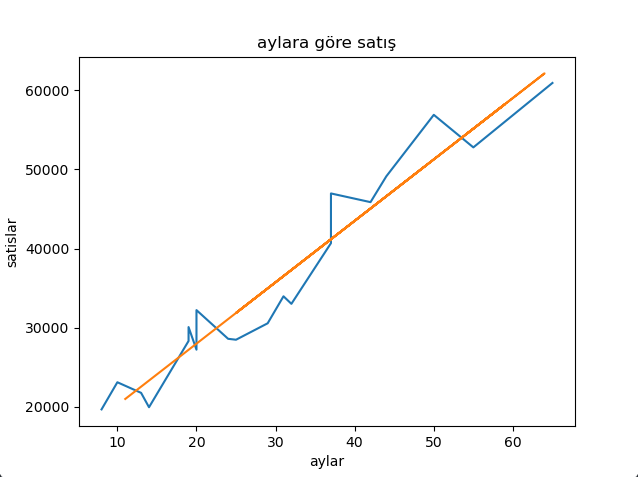
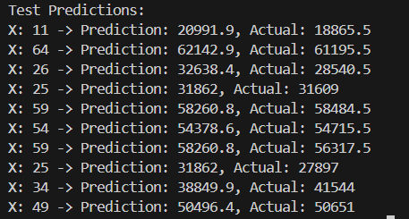

## Compilation Commands

```bash
g++ -o main main.cpp linearregression.cpp

```

---

# 📘 Linear Regression – A Complete Guide

This repository is a study resource for understanding **simple linear regression**.
It explains the theory step by step, including definitions, derivations, and key concepts such as random variables, mean-centered form, and regression sums of squares.

---

## 1. Introduction

Linear regression is one of the most fundamental methods in statistics and machine learning.

**Goal of Linear Regression:**
The primary goal is to find the best-fitting straight line through a set of data points to predict or understand the relationship between variables. Specifically, we aim to:

- **Predict** future values of Y based on known values of X
- **Quantify** the strength and direction of the linear relationship
- **Minimize** the prediction errors by finding optimal coefficients



> **📊 The orange line represents the best-fitting regression line through the data points.**

Linear regression models the relationship between a dependent variable (Y) and an independent variable (X) using a straight line:

[
Y \approx b_0 + b_1 X
]

where:

- (b_0) = intercept (the value of (Y) when (X=0)),
- (b_1) = slope (the rate of change in (Y) for a one-unit increase in (X)).

---

## 2. Random Variables in Regression

- A **random variable (RV)** is a variable whose values are outcomes of a random process.
- In regression:

  - The dependent variable (Y) is a random variable because its values vary due to noise and unobserved factors.
  - The error term (\varepsilon) is also random.
  - The independent variable (X) may be fixed or random depending on the context.

Model formulation:
[
Y_i = \beta_0 + \beta_1 X_i + \varepsilon_i
]

---

## 3. Estimating Coefficients – Least Squares Method

We estimate (b*0, b_1) by minimizing the **sum of squared errors (SSE):**
[
SSE = \sum*{i=1}^n (y_i - (b_0 + b_1 x_i))^2
]

Setting derivatives to zero leads to the **normal equations**:
[
n b_0 + \Big(\sum x_i\Big)b_1 = \sum y_i
]
[
\Big(\sum x_i\Big)b_0 + \Big(\sum x_i^2\Big)b_1 = \sum x_i y_i
]

These two equations yield unique values of (b_0, b_1) **if not all (x_i) are identical**.
👉 If all (x_i) are the same, the denominator in the slope formula becomes zero, and the regression line cannot be defined.

---

## 4. Solution for the Slope (b_1)

From the normal equations, we solve for slope:

### Raw form:

[
b_1 = \frac{\sum x_i y_i - n \bar{x}\bar{y}}{\sum x_i^2 - n\bar{x}^2}
]

### Mean-centered form:

[
b_1 = \frac{\sum (x_i - \bar{x})(y_i - \bar{y})}{\sum (x_i - \bar{x})^2}
]

### Intercept:

[
b_0 = \bar{y} - b_1 \bar{x}
]

---

## 5. Mean-Centered Form Explained

**Mean-centering** means subtracting the mean from each value:
[
x_i^* = x_i - \bar{x}, \quad y_i^* = y_i - \bar{y}
]

Why useful?

- It makes formulas simpler (cross terms vanish).
- It shows slope = covariance / variance:
  [
  b_1 = \frac{\text{Cov}(X,Y)}{\text{Var}(X)}
  ]

### Variance and Covariance:

- Variance: (\text{Var}(X) = \frac{1}{n}\sum (x_i-\bar{x})^2)
- Covariance: (\text{Cov}(X,Y) = \frac{1}{n}\sum (x_i-\bar{x})(y_i-\bar{y}))

So regression slope is literally:
[
b_1 = \frac{\text{Cov}(X,Y)}{\text{Var}(X)}
]

---

## 6. Shorthand Notation: (S*{xx}, S*{yy}, S\_{xy})

To simplify notation, textbooks define:

- (S\_{xx} = \sum (x_i-\bar{x})^2)
- (S\_{yy} = \sum (y_i-\bar{y})^2)
- (S\_{xy} = \sum (x_i-\bar{x})(y_i-\bar{y}))

Then:

- Slope: (b*1 = \tfrac{S*{xy}}{S\_{xx}})
- Intercept: (b_0 = \bar{y} - b_1 \bar{x})
- Correlation coefficient:
  [
  r = \frac{S_{xy}}{\sqrt{S_{xx}S_{yy}}}
  ]

---

## 7. Example (Step-by-Step)

Let’s fit regression for:

[
x = [1,2,3,4], \quad y = [2,4,5,4]
]

1. Means:
   (\bar{x} = 2.5, \quad \bar{y} = 3.75)

2. Compute sums:

   - (S\_{xx} = (1-2.5)^2 + (2-2.5)^2 + (3-2.5)^2 + (4-2.5)^2 = 5.0)
   - (S\_{xy} = \sum (x_i-\bar{x})(y_i-\bar{y}) = 3.5)

3. Slope:
   (b*1 = S*{xy}/S\_{xx} = 3.5/5.0 = 0.7)

4. Intercept:
   (b_0 = \bar{y} - b_1\bar{x} = 3.75 - 0.7(2.5) = 2.0)

Final regression line:
[
\hat{y} = 2.0 + 0.7x
]

---

## 8. Making Predictions

Once we have our regression coefficients (b_0, b_1), we can make predictions for new values of X:

[
\hat{y} = b_0 + b_1 \cdot x_{new}
]


**Why Linear Regression is Essential in Machine Learning:**

1. **Foundation for Complex Models**: Linear regression serves as the building block for more advanced ML algorithms like logistic regression, neural networks, and ensemble methods.

2. **Interpretability**: Unlike black-box models, linear regression provides clear insights into how each input variable affects the output, making it valuable for decision-making.

3. **Speed and Efficiency**: Training is fast and computationally inexpensive, making it ideal for real-time applications and large datasets.

4. **Baseline Model**: It's often used as a benchmark to compare the performance of more complex models.

5. **Feature Selection**: Helps identify which variables are most important for prediction through coefficient analysis.

**Real-world Applications:**

- Predicting house prices based on size, location, features
- Forecasting sales revenue from advertising spend
- Estimating medical costs from patient characteristics
- Stock price prediction using economic indicators

---

## 9. Summary

- Regression models (Y) as a linear function of (X) plus error.
- (Y) and (\varepsilon) are random variables.
- Regression fails if all (x_i) are identical.
- Slope can be written in raw form or mean-centered form.
- Mean-centering links regression directly to covariance and variance.
- Shorthand notation (S*{xx}, S*{yy}, S\_{xy}) makes formulas compact.
- The regression line is:
  [
  \hat y = b_0 + b_1 x, \quad b_1 = \frac{S_{xy}}{S_{xx}}, ; b_0 = \bar{y} - b_1 \bar{x}
  ]

---
